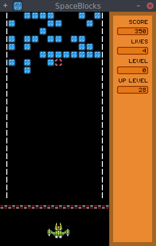

# PuzzleBlock

© 2016 Alfonso Saavedra "Son Link"

Under GNU GPL version 3 license

SpaceBlocks is a simple puzzle game. The goal is complete the lines to eliminate them before they get down. This game is based on one of the popular games include in many LCD machines. This game is avaiable for Windows, Linux and soon for Nintendo 3DS

## Instalation:

### Linux:
You need donwload **Löve** 0.9.0 or newer from official web and compile or, is avaliable, from the repositories of your GNU/Linux distro. For example on **Archlinux**: `pacman -S love`

Open a terminal and run `love path/to/SpaceBlocks.love` or `love path/to/SpaceBlocksFolder/`

Other trick is create a custom executable:

`cat /usr/bin/love SpaceBlocks.love > spaceblocks`

### Windows:
Simply download the zip, unzip and double click on **SpaceBlocks.exe**

[Windows 32 bits](https://dl.dropboxusercontent.com/u/58286032/juegos/SpaceBlocks/SpaceBlocks-win32.zip)

[Windows 64 bits](https://dl.dropboxusercontent.com/u/58286032/juegos/SpaceBlocks/SpaceBlocks-win64.zip)

##Controls:

**Left and right keys:** Select ship on the title screen/move the ship on game

**Space:** shot or start new game

**Scape:** exit game

**P:** Play/pause

##Other credits:

* **BGM Music:** **World Nap**, from the album **Cor Metallicum** by [**Ozzed**](http://ozzed.net) and under Creative Commons BY-SA license

* Sounds effects generated with the online tool [**As3sfxr**](http://www.superflashbros.net/as3sfxr/)

* Space ship created using [Modular Ships template](http://opengameart.org/content/modular-ships) by [Surt](http://opengameart.org/users/surt) and under CC0 license (Public Domain)

* Explosion animate is make use the **explosion set 1 m484 games** by [Master484](http://m484games.ucoz.com/) and under CC0 license (Public Domain)

[Source Code](https://github.com/son-link/SpaceBlocks)

[My blog (only on spanish)](http://son-link.githun.io)
