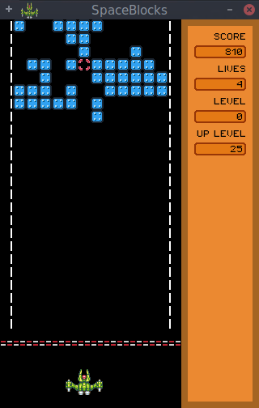

# PuzzleBlock

© 2016 Alfonso Saavedra "Son Link"

Under GNU GPL version 3 license

SpaceBlocks is a simple puzzle game. The goal is complete the lines to eliminate them before they get down. This game is based on one of the popular games include in many LCD machines. This game is avaiable for Windows, Linux and soon for Nintendo 3DS

##Controls:

**Left and right keys:** move the ship

**Space:** shot or start new game

**Scape:** exit game

**P:** Play/pause

##Downloads:

[Windows 32 bits](https://dl.dropboxusercontent.com/u/58286032/juegos/PuzzleBlock/PuzzleBlock-r1-win32.zip)

[Windows 64 bits](https://dl.dropboxusercontent.com/u/58286032/juegos/PuzzleBlock/PuzzleBlock-r1-win64.zip)

[Source Code](https://github.com/son-link/SpaceBlocks)

[My blog (only on spanish)](http://son-link.githun.io)